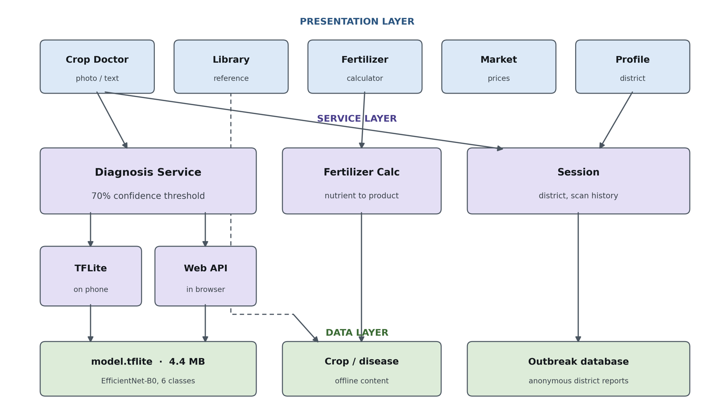
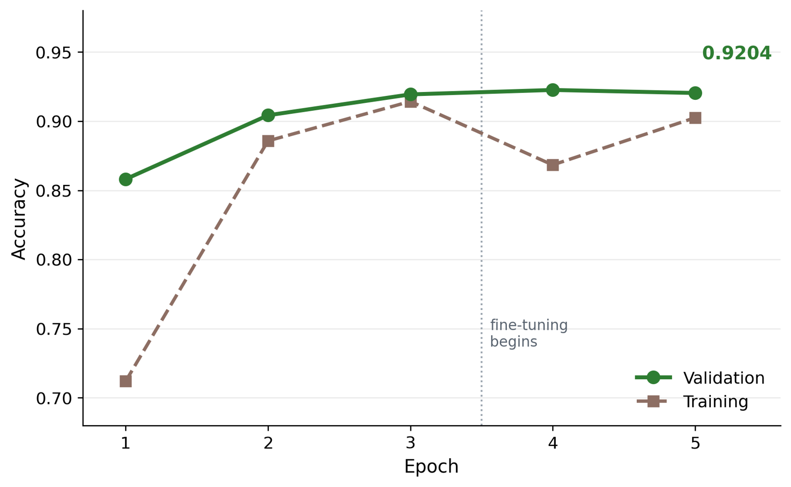

# NexusFarm

## Offline AI Decision Support for Smallholder Farming — From Planting to Market

A farming decision system that runs entirely on the phone, and refuses
to answer when it isn't sure.

<br>

| | |
|---|---|
| **Validation accuracy** | 92.04% |
| **Model size on device** | 4.4 MB |
| **Network required** | None, for diagnosis |
| **Confidence floor** | 70% before any advice is given |
| **Platforms** | Android, Web |

<br>

---

## The problem

Crop disease is a leading cause of yield loss for smallholder farmers in
Bangladesh. The obstacle is not that treatments are unavailable — it is
that **identification is unreliable**. Extension officers serve large
areas, neighbours advise from memory, and input dealers profit from the
chemicals they recommend.

The result is guesswork: the wrong product is bought, the money is lost,
the disease keeps spreading, and unnecessary pesticide enters soil and
water.

Existing mobile tools address this only partially. Most need a network
connection that rural fields lack. And nearly all of them return a
disease name **regardless of how uncertain the model is** — handing a
farmer a confident-sounding answer even when the system is guessing.

---

<!--
SCREENSHOTS — uncomment this block after adding the four images to
docs/images/. It is hidden until then so a visitor never sees a broken
image or a "screenshot goes here" note.

## Screenshots

| Diagnosis | Asks for another photo | Fertilizer | Outbreak warning |
|:---:|:---:|:---:|:---:|
|  |  |  |  |
| 94% confident — names the disease | 61% — refuses to guess | Answers in products you can buy | District-level early warning |
-->

## The design decision this project is built around

When the model's highest class probability falls below **0.70**,
NexusFarm does not name a disease. It asks for a clearer photograph
instead.

```dart
static const double confidenceThreshold = 0.70;

if (confidence < confidenceThreshold) {
  return DiagnosisResult(
    diseaseName: 'Not sure yet',
    needsFollowUp: true,
    followUpQuestion:
        'I am only ${(confidence * 100).round()}% sure, which is not '
        'enough to give you advice. Please send one more photo...',
  );
}
```

The reasoning is asymmetric cost:

- A correct diagnosis helps.
- An admission of uncertainty is unhelpful but harmless.
- A **confidently incorrect** diagnosis makes a farmer buy an
  ineffective chemical, lose that money, and lose the crop while the
  real disease spreads unchecked.

Where errors are expensive, a system should fail toward silence rather
than toward confident error. That is an ethical position, encoded as a
single constant.

---

## Features

**Crop Doctor** — Photograph a leaf, or describe the symptoms. Answers
appear with a confidence badge, the symptoms to look for, the treatment,
and the **pre-harvest interval**: how many days to wait after spraying
before harvest is safe. Most tools omit that last part; it is how
pesticide residue reaches food.

**Outbreak alerts** — Every confident diagnosis posts an anonymous
record: district, crop, disease, timestamp. Never a photograph, a name,
or a location. Once three reports of one disease appear in a district
within seven days, every farmer there is warned. This turns individual
diagnosis into **collective early warning** — something no single farmer
could obtain alone.

**Fertilizer calculator** — Converts crop, field size, soil fertility
and soil texture into kilograms of urea, TSP, MoP and gypsum, with a
split application schedule. Answers in products a farmer can buy, not in
nutrient abstractions. Supports bigha, decimal, katha, acre and hectare.

**Crop library** — Offline reference for crops and diseases: symptoms in
plain language, cause, treatment, pre-harvest interval. Works where the
model cannot classify a sample.

**Market prices** — Daily wholesale prices, cached server-side and
always labelled with how old they are. A stale price presented as
today's is worse than no price.

**Livestock** — Cattle and goats recorded one by one; chickens and
ducks as flocks. Vaccination and deworming schedules for all four
species, with each animal shown as up to date, due soon, overdue, or
missing a record. First doses are scheduled from the date of birth or
hatch when it is known.

**Withdrawal periods** — Every treatment records how many days its milk,
eggs and meat are unsafe, from the product label. While a period runs,
the animal is marked *on hold*, and milk or eggs logged during it are
recorded as **discarded** automatically — whatever quantity is typed,
it never counts as usable. This is the same safety principle as the
pre-harvest interval, applied to animal products: the reason crops and
livestock belong in one system rather than two.

**Spray records** — Every crop spray starts a harvest countdown. A
diagnosis can open the form pre-filled with the crop and the interval,
so the step from "what is wrong" to "when is it safe" is one tap.

**Today** — One list across crops and animals: what is on hold, what is
overdue, what is coming up. Holds come first. A vaccine a few days late
is a risk to the animal; selling milk during a withdrawal period is a
risk to whoever drinks it.

**Farm ledger** — One account for crops and animals together. Costs
entered on health and spray records are added automatically and removed
with them. Monthly totals, by category.

**Backup** — All records copy out as one block of text and restore the
same way. Records live on the phone; this is how they outlive it.

---

## Architecture



*Three layers, control flowing one way. Dashed lines are direct reads
that bypass the service layer.*

Control flows one way only. The interface never knows how inference
happens, so the model can be replaced or relocated without touching a
single screen.

That separation is what makes the web build possible at all: a browser
cannot load the native TensorFlow Lite library, so
`inference_web.dart` calls the API instead while
`inference_mobile.dart` runs the model on-device. A conditional import
picks one at compile time, and neither file is even parsed on the wrong
platform.

---

## The model

| | |
|---|---|
| Architecture | EfficientNet-B0, pre-trained on ImageNet |
| Method | Two-stage transfer learning |
| Dataset | PlantVillage — 4,652 images, 6 balanced classes |
| Split | 80 / 20, fixed seed |
| Result | **92.04%** validation accuracy |
| Export | TensorFlow Lite, dynamic-range quantised, 4.4 MB |

**Stage 1** freezes the backbone and trains only a new classifier head,
because a randomly initialised head would otherwise push large gradients
into the pre-trained features and degrade them.

**Stage 2** unfreezes the last twenty layers at a learning rate one
hundred times lower, letting the highest-level features adapt to leaf
imagery without the small dataset overwriting what ImageNet taught.



Final validation accuracy (0.9204) **exceeded** final training accuracy
(0.9025), which indicates the network did not memorise the training set.

### One preprocessing detail that matters

Pixel values are fed in at **0-255, not divided by 255**. EfficientNet's
`preprocess_input` is inside the exported graph, so the model normalises
its own input. Scaling externally as well would scale twice and produce
confident nonsense. The Dart and Python code both follow this — a
mismatch would break predictions while the code ran without error.

---

## Security

A penetration test was run against the API. Four issues were found and
fixed, the most serious being **outbreak data poisoning**: with no rate
limiting, a single client injected 200 fabricated reports in 0.5 seconds
and the app announced them as real.

The fix caps one source at **2 reports per district per day** against an
alert threshold of 3 — so no single source can manufacture a warning.

Run the test suite yourself:

```bash
cd backend && python pentest.py
```

Full write-up, including what remains unresolved, in
[SECURITY.md](SECURITY.md).

---

## Running it

### Mobile

```bash
flutter pub get
flutter run
```

The trained model is already in `assets/model/`, so it works out of the
box with no server.

### Backend (needed for web, outbreaks, prices and text triage)

```bash
cd backend
pip install -r requirements.txt
uvicorn main:app --reload --port 8000
```

Optional, for the text-description feature:

```bash
export GEMINI_API_KEY=your_key   # aistudio.google.com/apikey
```

### Web

```bash
flutter run -d chrome --dart-define=API_BASE=http://localhost:8000
```

### Seeding outbreak data for a demo

The banner stays hidden until reports exist, which on a fresh database
is nobody:

```bash
cd backend && python seed_demo_data.py
```

---

## Repository layout

```
lib/
  core/app_theme.dart          colours, typography
  models/                      Crop, Disease, DiagnosisResult, fertilizer types
  services/
    diagnosis_service.dart     the 70% threshold lives here
    inference_backend.dart     interface + conditional import
    inference_mobile.dart      TensorFlow Lite, on-device
    inference_web.dart         API call, for browsers
    label_lookup.dart          model labels -> reviewed advice
    fertilizer_calculator.dart nutrient -> product conversion
    crop_data.dart             offline reference content
    session.dart               district + scan history, persisted
  screens/                     crop doctor, library, fertilizer, market, profile
  widgets/                     result card, outbreak banner
  core/dates.dart              calendar-day arithmetic, DST-safe
  farm/
    models/                    animals, health events, production, ledger, sprays
    data/schedules.dart        vaccination and deworming intervals
    data/drug_presets.dart     typical withdrawal periods (label overrides)
    logic/livestock_logic.dart schedule status and withdrawal holds
    logic/agenda.dart          the Today list
    store/farm_data.dart       versioned storage format
    store/farm_store.dart      persistence, cascade deletes, backup
    ui/                        today, livestock, forms, ledger, tools

test/                          unit tests — run with `flutter test`

backend/
  main.py                      FastAPI endpoints
  security.py                  rate limiting, payload caps
  outbreaks.py                 SQLite aggregation by district
  prices.py                    price cache
  text_triage.py               constrained LLM triage
  pentest.py                   the security test suite
  train_full.py                training on all 38 classes
  make_label_stubs.py          generates Dart entries for 38 classes
```

---

## Testing

```bash
flutter analyze
flutter test
```

The tests cover the parts where a mistake would hurt someone rather than
look wrong: vaccination due dates, the exact day a withdrawal period
ends, that milk logged during one is discarded, that deleting a record
removes its cost, that a damaged save file is kept rather than lost, and
that a bad backup is refused without touching existing records.

Two lightweight checkers, `tool_check_dart.py` and `tool_check_args.py`,
catch unbalanced brackets, unresolved imports, missing imports and wrong
named arguments without a Dart SDK. They are not a substitute for
`flutter analyze`.

---

## Honest limitations

These are stated plainly because they matter more than the accuracy
figure.

**92.04% is a laboratory number.** PlantVillage images show a single
detached leaf on a plain background under even light. Field photographs
are cluttered and unevenly lit, and accuracy will be lower. **How much
lower has not been measured** — doing so is the most important
outstanding task.

**No independent test partition.** The data was split into training and
validation only. Because the validation set informed decisions during
training, the reported figure may be slightly optimistic.

**Possible near-duplicate leakage.** PlantVillage may contain several
photographs of the same physical leaf. The split was random at the image
level rather than the leaf level, which could inflate the measurement.
This was not checked.

**Treatment content is not expert-verified.** It is drawn from published
agricultural extension sources but has not been reviewed by a qualified
agronomist. Wrong chemical advice costs a farmer a season, so this
review is a prerequisite for real use.

**Rice and wheat are in the library but not in the model.** PlantVillage
contains no data for either, despite rice being Bangladesh's principal
food crop.

**Livestock intervals and withdrawal presets are not vet-verified.**
Vaccination intervals follow typical Bangladeshi practice and the drug
presets lean long rather than short, but programmes and brands differ.
The form always shows withdrawal days as editable fields and asks the
farmer to use the number on the label. A veterinarian should still
review both tables before real use.

**Farm records live on one phone.** There is no sync. Backup exists, but
a farmer has to use it.

**Rate limiting is per IP.** A distributed attacker could still skew a
district's outbreak data. Real defence needs identity verification.

---

## Roadmap

- Measure accuracy on real field photographs and report both numbers
- Get all treatment content reviewed by an agronomist
- Merge a rice disease dataset and retrain
- Have a veterinarian review the vaccination intervals and withdrawal
  presets, as with the crop treatments
- Reminders as phone notifications, not only on the Today screen
- Shared records for a household or cooperative, which needs accounts

---

## Built with

Flutter · Dart · TensorFlow · TensorFlow Lite · FastAPI · SQLite

---

## Author

**Ovejit Paul Dhrobo**
Department of Computer Science and Engineering
Bangladesh University of Business and Technology

Submitted to the **World Sustainable Development Goals Challenge (WSDG)
2026**, Multimedia University, Malaysia — Project ID `UCA1006`.

---

## Licence

MIT — see [LICENSE](LICENSE).

The trained model and agricultural content are provided for research and
educational purposes. **Do not use the treatment recommendations to
guide real applications until they have been reviewed by a qualified
agronomist.**
